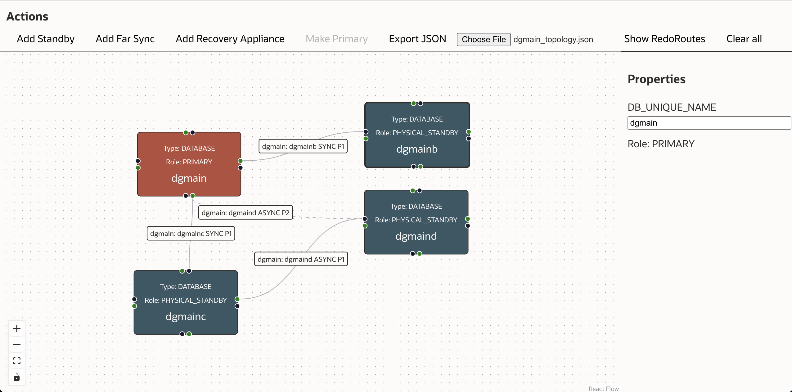
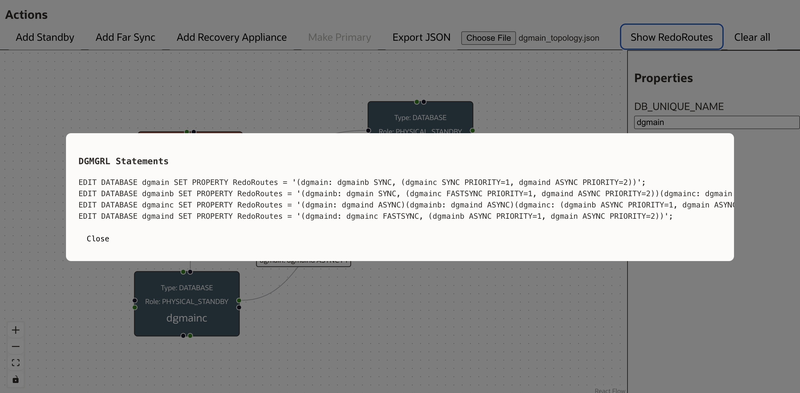

# Oracle Active Data Guard RedoRoutes Helper

A 70% "vibe-coded" **frontend‑only** application for designing Oracle Active Data Guard redo topologies visually using React Flow.

You can directly try the static build on my personal site: [https://www.ludovicocaldara.net/adg-topology/](https://www.ludovicocaldara.net/adg-topology/)




## 📖 Overview

The Active Data Guard RedoRoutes Helper lets you:

- **Design** Oracle Active Data Guard RedoRoutes configurations with drag‑and‑drop.
- **Add** physical standby, Far Sync, and Recovery Appliance nodes.
- **Connect** nodes with Log Archive Destination (LAD) edges and configure their basic properties.
- **Generate** DGMGRL broker statements automatically.
- **Export / Import** topology JSON files.
- **Validate** the design in real‑time with warnings and errors.

## 🎯 Use Cases

| Use Case | Description |
|----------|-------------|
| **Initial Architecture Design** | Sketch a new Data Guard topology before deploying the databases. |
| **Change Management** | Visualise the impact of adding/removing standby databases or changing LAD properties. |
| **Training & Presentations** | Show your customer or company how Active Data Guard works without needing a live environment. |
| **Configuration Generation** | Export the generated DGMGRL statements to include in deployment scripts. |
| **Versioning** | Export topology as JSON and version it to keep topology changes over time. |
| **Troubleshooting** | Identify mis‑configured LAD connections or missing properties quickly. |

## 📋 Instructions

1. Start by adding standby databases, far syncs, and recovery appliances using the toolbox above.  
2. **Important**: Click on every database (or Far Sync or ZDLRA) and set their DB_UNIQUE_NAME to match your environment. It will not be possible to change it later!  
3. Drop the topology by connecting the databases to each other using mouse drag-and-drop. Start from one of the green dots (source) and connect to a database's black dots (target).  
4. Click on edges (connections) to set properties like LogXptMode, Priority, and Alternate To (this is required when the source has multiple destinations and you need to specify to which of those the current one is alternate).  
5. Once you complete the topology for one primary database, switch the primary by selecting a standby and clicking "Make Primary" in the toolbox. The visualization will update to show the redo routes for the new primary.  
6. Once every topology for every potential primary database is complete, click "Show RedoRoutes" to generate the DGMGRL statements needed to configure redo transport routes.  
7. You can export your topology to a JSON file for later use with this application, or import an existing topology.  
8. Clear all to start fresh anytime.  
9. Note: This tool runs entirely in your browser; no data is sent to any server. Data is persisted only in your browser. Clearing the cookies will reset your configuration.  
10. Enjoy designing your Data Guard topologies with ease! Ideas or issues? Feel free to create issues or pull requests on the [GitHub repository](https://github.com/ludovicocaldara/adg-topology)

## Embedded checks

The application does a few sanity checks and raises warnings or disable buttons accordingly:

- No more than 10 SYNC or FASTSYNC destinations.
- Only ASYNC cascaded destinations.
- No loops.
- No more than 30 destinations from the same source.
- No more than 127 total members in the configuration.
- All database members should receive redo.
- No members can receive from two sources.

However, the resulting RedoRoutes do not have the same level of validation as the real Active Data Guard.

## Limitations

- Once connections are created from one database to another, changing the DB_UNIQUE_NAME of either databases will mess up the RedoRoutes configuration. If you need to do so, export the JSON, replace the DB_UNIQUE_NAME everywhere in the JSON file, and import it again.

- Users should know how Active Data Guard works, and only create topologies that make sense. Although there are checks in the application, the only real validation occurs through setting the RedoRoutes in a real Active Data Guard environment.

- The application is *not* supported by Oracle. It's a personal project and as such, I maintain it on GitHub. You can open issues, but I'd be happy to rather see pull requests :-)

---

*For detailed build and run instructions, see the accompanying **BUILD.md** file.*

## 🚀 Getting Started on your laptop (see `BUILD.md` for full local‑run instructions)

```bash
# Clone the repo (if you haven't already)
git clone https://github.com/ludovicocaldara/adg-topology.git
cd adg-topology

# Install dependencies
npm install

# Run the development server
npm run dev
```

Open `http://localhost:5173` in your browser to start designing.

## 📚 Documentation Links

- **RedoRoutes Property (Oracle Data Guard Broker Concepts Documentation)** –  
  [https://docs.oracle.com/en/database/oracle/oracle-database/26/dgbkr/oracle-data-guard-broker-properties.html](https://docs.oracle.com/en/database/oracle/oracle-database/26/dgbkr/oracle-data-guard-broker-properties.html#GUID-FB1A96ED-5E6D-43FE-BFC4-6A808E589410)

- **Video Overview** –  
  [Understanding the Oracle Data Guard RedoRoutes property](https://www.youtube.com/watch?v=huG8JPu_s4Q)

## 🎨 Visual Design

- **Color Scheme**  
  - Primary Database: Redwood Red `#B84F3C`  
  - Standby Databases: Redwood Blue `#375865`  
  - Far Sync / Recovery Appliance: Redwood Grey `#8A8580`

- **Font** – Oracle Sans (fallback: Haas Unica)

## 🛠️ Development

- **Framework** – React 19 + Vite  
- **Diagram Library** – `@xyflow/react` (React Flow)  
- **State Management** – React hooks (no external store)  

## 📂 Project Structure (high‑level)

```text
src/
 ├─ components/          # UI components (nodes, edges, panels)
 ├─ App.jsx              # Main application shell
 ├─ main.jsx             # Entry point
 └─ assets/              # Images, icons, etc.
public/
 └─ index.html           # HTML template
```

---

## License

This project is released under the MIT license. See [LICENSE.txt](LICENSE.txt) for license text and copyright notice.
